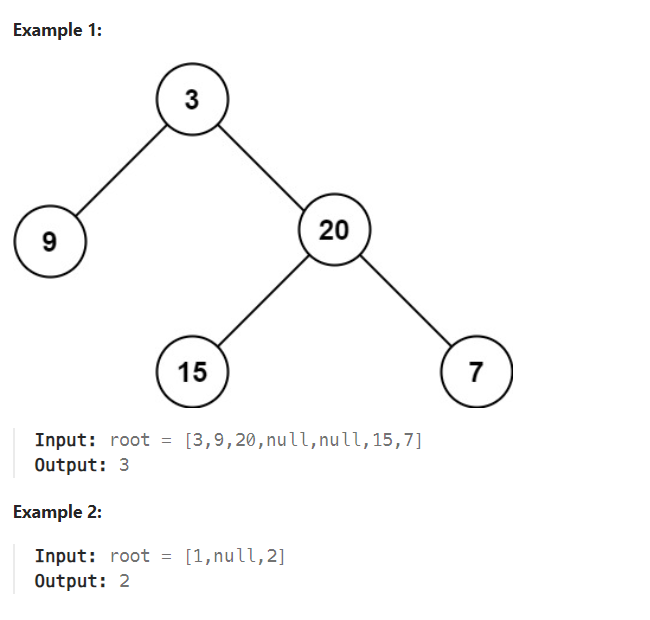

# LeetCode Problem: Maximum Depth of Binary Tree

## Problem Explanation

In this LeetCode problem, you are given the root of a binary tree, and your task is to find the maximum depth of the tree. The maximum depth of a binary tree is defined as the number of nodes along the longest path from the root node down to the farthest leaf node.

### Example:



## Solution

### Solution 1: Recursive DFS

```python
class Solution:
    def maxDepth(self, root: Optional[TreeNode]) -> int:
        if not root:
            return 0
        return 1 + max(self.maxDepth(root.left), self.maxDepth(root.right))
```

This solution uses a depth-first search (DFS) approach to traverse the tree recursively. If the `root` is None (i.e., there's no tree), the depth is 0. Otherwise, it recursively calculates the maximum depth of the left and right subtrees and returns the maximum depth among them.

### Solution 2: BFS

```python
class Solution:
    def maxDepth(self, root: Optional[TreeNode]) -> int:
        if not root:
            return 0
        level = 0
        q = deque([root])
        while q:
            for i in range(len(q)):
                node = q.popleft()
                if node.right:
                    q.append(node.right)
                if node.left:
                    q.append(node.left)
            level += 1
        return level
```

This solution uses a breadth-first search (BFS) approach to traverse the tree iteratively. It starts at the root node and uses a queue to keep track of the nodes at each level. It increments the `level` counter for each level of nodes processed until the queue is empty, which gives you the maximum depth of the tree.

### Solution 3: Iterative DFS

```python
class Solution:
    def maxDepth(self, root: Optional[TreeNode]) -> int:
        if not root:
            return 0
        stack = [[root, 1]]
        res = 1
        while stack:
            node, depth = stack.pop()
            if node:
                res = max(res, depth)
                stack.append([node.left, depth + 1])
                stack.append([node.right, depth + 1])
        return res
```

This solution also uses a depth-first search (DFS) approach but in an iterative manner. It uses a stack to keep track of nodes and their depths. As it iteratively processes the nodes, it keeps track of the maximum depth encountered, which is returned as the result.

