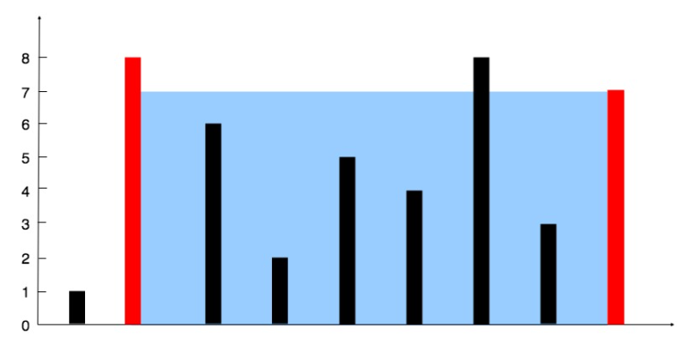

# LeetCode Problem: Container With Most Water

## Problem Description

You are given an integer array `height` of length `n`. There are `n` vertical lines drawn such that the two endpoints of the ith line are `(i, 0)` and `(i, height[i])`. Your task is to find two lines that, together with the x-axis, form a container such that the container contains the most water. You may not slant the container. Return the maximum amount of water the container can store.

## Example

**Input:**
```python
height = [1,8,6,2,5,4,8,3,7]
```

**Output:**
```python
49
```

**Explanation:**
The maximum area can be obtained by choosing the second and ninth lines, forming a container with a height of 7 and a width of 8, resulting in an area of 7 x 8 = 56. However, the container with the minimum height (1) is the limiting factor, so the maximum area is 7 x 1 = 7.

## Solution Explanation

To solve this problem efficiently, you can use a two-pointer approach. Here's an explanation of the provided solution:

```python
class Solution:
    def maxArea(self, height: List[int]) -> int:
        l, r = 0, len(height) - 1  # Initialize two pointers, one at the start and one at the end.
        res = 0  # Initialize the result to 0 to keep track of the maximum area.

        while l < r:
            # Calculate the width of the container.
            width = r - l
            # Calculate the height of the container (minimum of the two heights).
            container_height = min(height[l], height[r])
            # Calculate the area of the current container.
            area = width * container_height
            # Update the result if the current area is greater.
            res = max(res, area)

            # Move the pointer that points to the shorter line inward.
            if height[l] < height[r]:
                l += 1
            else:
                r -= 1

        return res  # Return the maximum area found.
```

1. **Initializing Pointers**: We start with two pointers, `l` and `r`, initialized to the beginning and end of the `height` list, respectively. These pointers represent the two lines forming the current container.

2. **Initialize Result**: `res` is initialized to 0, which will keep track of the maximum area found.

3. **Main Loop**: We use a `while` loop with the condition `l < r` to iterate until the two pointers meet.

4. **Calculate Width and Height**: In each iteration, we calculate the width of the current container as `width = r - l`. We also calculate the height of the container as the minimum of the heights at the two pointers, i.e., `container_height = min(height[l], height[r])`.

5. **Calculate Area**: The area of the current container is calculated as `area = width * container_height`.

6. **Update Maximum Area**: We update the maximum area `res` by taking the maximum of the current area and the previous maximum.

7. **Move Pointers**: We move the pointer that points to the shorter line inward. This step ensures that we are exploring containers with potentially greater heights, as using the taller line would maximize the area. If the heights are equal, moving either pointer is equivalent.

8. **Return Maximum Area**: Finally, we return the maximum area found after the loop completes.

