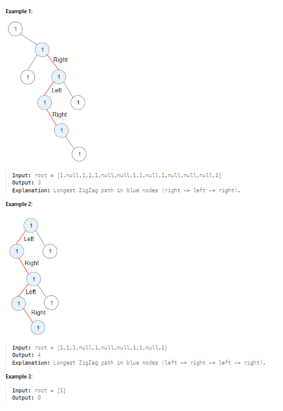

# LeetCode Problem: Longest ZigZag Path in a Binary Tree

## Problem Explanation

You are given the root of a binary tree. A ZigZag path for a binary tree is defined as follows:

1. Choose any node in the binary tree and a direction (right or left).
2. If the current direction is right, move to the right child of the current node; otherwise, move to the left child.
3. Change the direction from right to left or from left to right.
4. Repeat the second and third steps until you can't move in the tree.

Zigzag length is defined as the number of nodes visited - 1. (A single node has a length of 0). Your task is to return the longest ZigZag path contained in that tree.

### Example:


## Solution

```python
# Definition for a binary tree node.
# class TreeNode:
#     def __init__(self, val=0, left=None, right=None):
#         self.val = val
#         self.left = left
#         self.right = right

class Solution:
    def longestZigZag(self, root: Optional[TreeNode]) -> int:
        return max(self.helper(root.right, False, 0), self.helper(root.left, True, 0))
    
    def helper(self, root, ifLeft, depth):
        if not root:
            return depth
        
        if ifLeft:
            depth = max(depth, self.helper(root.right, False, depth + 1), self.helper(root.left, True, 0))
        else:
            depth = max(depth, self.helper(root.left, True, depth + 1), self.helper(root.right, False, 0))

        return depth
```

Explanation of the solution:

1. We define a class `Solution` that contains two functions: `longestZigZag` and `helper`.

2. The `longestZigZag` function is the main function that we call with the root of the binary tree. It returns the maximum of two values:
   - `self.helper(root.right, False, 0)`: This function call starts from the right child of the current node and initializes the direction as 'False' (right). The initial depth is 0.
   - `self.helper(root.left, True, 0)`: This function call starts from the left child of the current node and initializes the direction as 'True' (left). The initial depth is 0.

3. The `helper` function is a recursive function that explores the binary tree. It takes three parameters: `root` (the current node), `ifLeft` (a boolean flag indicating if the direction is left), and `depth` (the current depth of the zigzag path).

4. If the current node is `None` (i.e., there's no child), the function returns the current depth.

5. If the direction is left (`ifLeft` is `True`), we explore the left child first, increasing the depth by 1. We also explore the right child but reset the depth to 0 since we're changing the direction to right. We take the maximum of these depths.

6. If the direction is right (`ifLeft` is `False`), we explore the right child first, increasing the depth by 1. We also explore the left child but reset the depth to 0 since we're changing the direction to left. We take the maximum of these depths.

7. The `helper` function keeps recursively exploring the tree in a zigzag manner, and the maximum depth achieved is returned.
