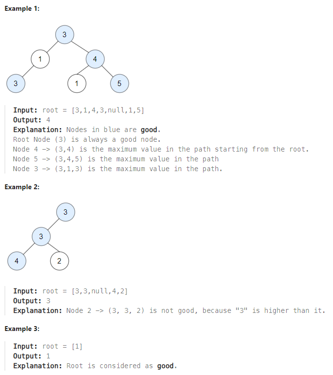

# LeetCode Problem: Count Good Nodes in Binary Tree

## Problem Explanation

In this problem, you are given a binary tree with a root node. A node X in the tree is considered good if, in the path from the root to X, there are no nodes with a value greater than X. Your task is to count the number of good nodes in the binary tree.

### Example :


## Solution

To solve this problem, you can use Depth First Search (DFS) traversal. You start from the root node and traverse the tree while keeping track of the maximum value encountered so far along the path. If a node's value is greater than or equal to the maximum value encountered so far, it is a good node.

Here's how you can implement the solution in Python:

```python
# Definition for a binary tree node.
# class TreeNode:
#     def __init__(self, val=0, left=None, right=None):
#         self.val = val
#         self.left = left
#         self.right = right

class Solution:
    def goodNodes(self, root: TreeNode) -> int:
        def DFS(node, max_value):
            if not node:
                return 0
            
            # Check if the current node is a good node
            res = 1 if node.val >= max_value else 0
            
            # Update the maximum value encountered so far
            max_value = max(node.val, max_value)
            
            # Recur for the left and right subtrees and add the results
            res += DFS(node.left, max_value)
            res += DFS(node.right, max_value)
            
            return res
        
        # Start DFS from the root with the initial maximum value as the root's value
        return DFS(root, root.val)
```

In this solution, the `DFS` function takes a node and the maximum value encountered so far. It checks if the current node is a good node, updates the maximum value, and then recurs for the left and right subtrees. The result is the sum of good nodes in the left subtree, right subtree, and the current node itself.

