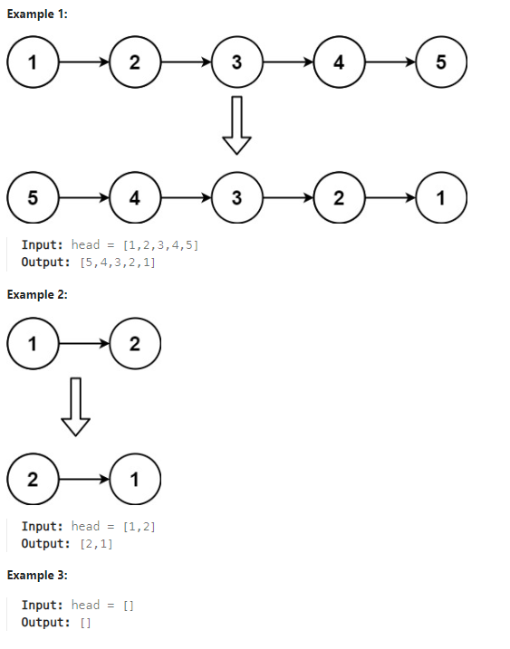

# LeetCode Problem: Reverse Linked List

## Problem Explanation

Given the head of a singly linked list, reverse the list, and return the reversed list.

### Example:



## Solution

```python
# Definition for singly-linked list.
# class ListNode:
#     def __init__(self, val=0, next=None):
#         self.val = val
#         self.next = next
class Solution:
    def reverseList(self, head: Optional[ListNode]) -> Optional[ListNode]:
        if not head or not head.next:
            return head 
        pre = None
        now = head
        while now:
            next_node = now.next
            now.next = pre 
            pre = now
            now = next_node
        return pre
```

### Explanation

The problem requires reversing a singly linked list. The solution provided is a Python class method that takes the head of the linked list as input and returns the reversed list.

Here's how the solution works:

1. It checks if the input head is either `None` or the last node (i.e., no node or only one node in the list). In such cases, it returns the input head as the reversed list because reversing it wouldn't change anything.

2. It initializes two pointers, `pre` and `now`, to `None` and the head of the linked list, respectively.

3. It enters a loop that iterates through the linked list. Inside the loop:
   - `next_node` is used to temporarily store the next node in the original list.
   - The `now.next` pointer is set to `pre`, effectively reversing the direction of the current node.
   - `pre` is then updated to `now`, and `now` is updated to `next_node`.

4. Once the loop completes, `pre` will point to the new head of the reversed list, and `now` will be `None` as it has reached the end of the original list.

5. The function returns `pre`, which is the head of the reversed list.
