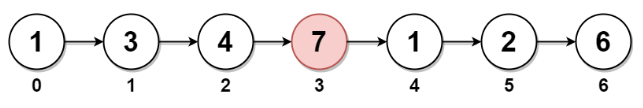

# LeetCode Problem: Delete the Middle Node of a Linked List

## Problem Explanation

You are given the head of a linked list. Your task is to delete the middle node and return the head of the modified linked list. The middle node of a linked list of size `n` is defined as the ⌊n / 2⌋th node from the start using 0-based indexing, where ⌊x⌋ denotes the largest integer less than or equal to x.

### Example:

#### Example 1:

Input: head = [1,3,4,7,1,2,6]
Output: [1,3,4,1,2,6]

Explanation:
Since n = 7, node 3 with a value of 7 is the middle node, marked in red. After removing this node, we return the new list.

#### Example 2:

Input: head = [1,2,3,4]
Output: [1,2,4]

Explanation:
For n = 4, node 2 with a value of 3 is the middle node (marked in red). After removing this node, we return the modified list.

#### Example 3:

Input: head = [2,1]
Output: [2]

Explanation:
For n = 2, node 0 with a value of 2 is the middle node (marked in red). After removing node 1, only node 0 remains in the list.

## Solution
```python
# Definition for singly-linked list.
# class ListNode:
#     def __init__(self, val=0, next=None):
#         self.val = val
#         self.next = next

class Solution:
    def deleteMiddle(self, head: Optional[ListNode]) -> Optional[ListNode]:
        if not head.next:
            return head.next

        fast, slow = head.next.next, head
        while fast and fast.next:
            slow = slow.next
            fast = fast.next.next
        slow.next = slow.next.next
        return head
```

The provided Python solution demonstrates how to delete the middle node from a linked list. The code uses a two-pointer approach, where one pointer (fast) advances two nodes at a time, and the other pointer (slow) advances one node at a time. When the fast pointer reaches the end of the list, the slow pointer will be at the middle node. It then removes the middle node and returns the modified list.