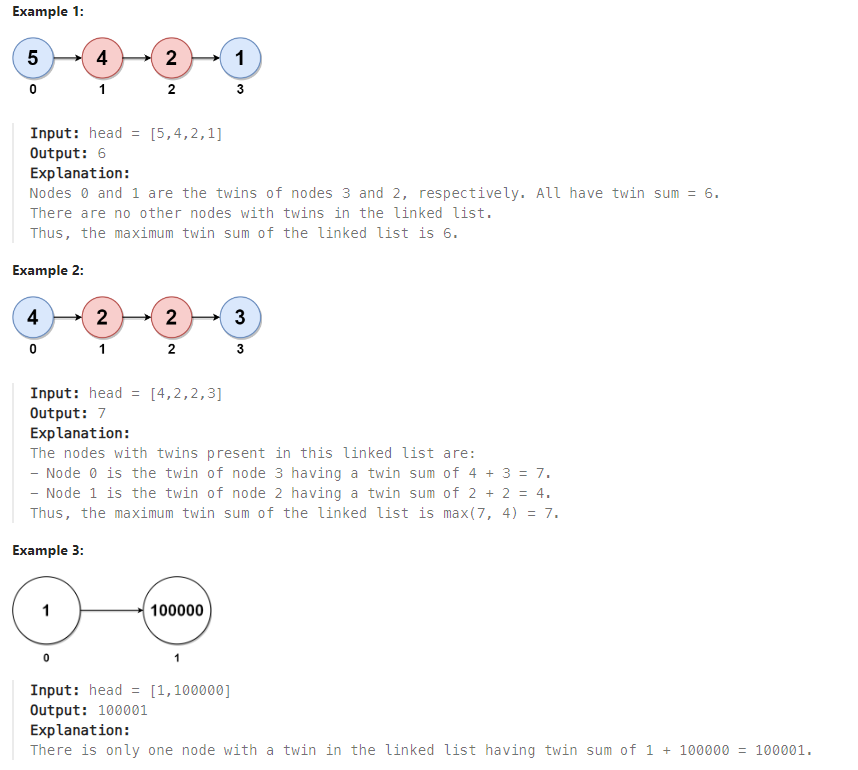
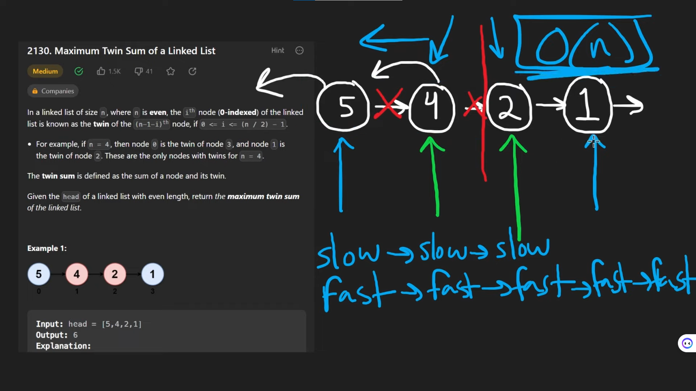

# LeetCode Problem: Maximum Twin Sum of a Linked List

## Problem Explanation

You are given a linked list of even size, where each node is associated with its "twin," defined as the node that is the same distance from the end of the list as the given node is from the beginning. For example, if the linked list has 4 nodes, node 0 is the twin of node 3, and node 1 is the twin of node 2. These are the only nodes with twins for an even-sized list.

The twin sum is the sum of a node and its twin. Your task is to find and return the maximum twin sum for the given linked list.

### Example:


## Solution


```python
# Definition for singly-linked list.
# class ListNode:
#     def __init__(self, val=0, next=None):
#         self.val = val
#         self.next = next
class Solution:
    def pairSum(self, head: Optional[ListNode]) -> int:
        slow, fast = head, head
        pre = None
        res = 0
        while fast and fast.next:
            fast = fast.next.next
            tmp = slow.next
            slow.next = pre
            pre = slow
            slow = tmp 
        while slow:
            res = max(res, pre.val+slow.val)
            slow = slow.next
            pre = pre.next
        return res
```

This solution starts by reversing the first half of the linked list to make it easier to find the twins. It uses two pointers, `slow` and `fast`, where `slow` advances one node at a time, and `fast` advances two nodes at a time. The reversed part of the list allows us to compare corresponding nodes and calculate the twin sum, updating the result whenever a new maximum is found.

## Reference
- [Neetcode Maximum Twin Sum of a Linked List - Leetcode 2130 - Python](https://www.youtube.com/watch?v=doj95MelfSA)