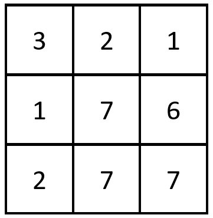
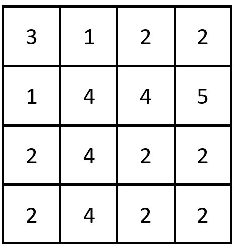

# LeetCode Problem: Equal Row and Column Pairs

## Problem Explanation

You are given a square, 0-indexed matrix `grid` of size n x n, and your task is to count the number of pairs (ri, cj) such that a row ri and a column cj are equal, meaning they contain the same elements in the same order (i.e., they are equal arrays).

Here's an example to illustrate the problem:

### Example 1:



**Input:**
```
grid = [[3, 2, 1],
        [1, 7, 6],
        [2, 7, 7]]
```

**Output:**
```
1
```

**Explanation:**
There is 1 equal row and column pair:
- (Row 2, Column 1): [2, 7, 7]

### Example 2:



**Input:**
```
grid = [[3, 1, 2, 2],
        [1, 4, 4, 5],
        [2, 4, 2, 2],
        [2, 4, 2, 2]]
```

**Output:**
```
3
```

**Explanation:**
There are 3 equal row and column pairs:
- (Row 0, Column 0): [3, 1, 2, 2]
- (Row 2, Column 2): [2, 4, 2, 2]
- (Row 3, Column 2): [2, 4, 2, 2]

## Solution

To solve this problem, you can use a Python class like the one shown below:

```python
class Solution:
    def equalPairs(self, grid: List[List[int]) -> int:
        cal_map = {}
        count = 0
        for i in grid:
            cal_map[tuple(i)] = cal_map.get(tuple(i), 0) + 1
        for i in range(len(grid)):
            tmp = []
            for j in range(len(grid)):
                tmp.append(grid[j][i])
            count += cal_map.get(tuple(tmp), 0)
        return count
```

This solution works as follows:

1. Initialize an empty dictionary `cal_map` to keep track of the counts of each row.
2. Initialize a `count` variable to keep track of the total number of equal row and column pairs.
3. Iterate through each row `i` in the `grid`:
   - Convert the row `i` to a tuple and store it in the `cal_map` dictionary. If the tuple is not in the dictionary, initialize its count to 1; otherwise, increment the count.
4. Next, iterate through the columns:
   - For each column, create a `tmp` list to store the elements of that column.
   - Convert the `tmp` list to a tuple.
   - Use the `get` method to check if the tuple is in the `cal_map` dictionary. If it is, add the count to the `count` variable.
5. Finally, return the `count` as the result.

