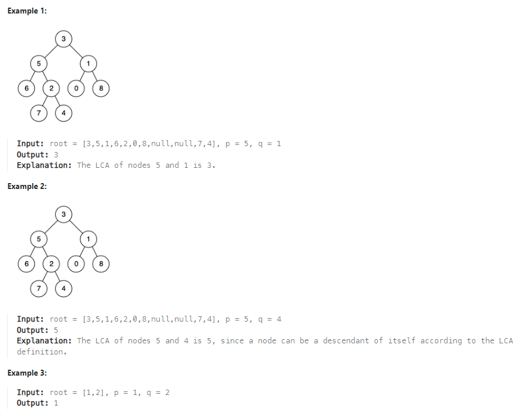

# LeetCode Problem: Lowest Common Ancestor of a Binary Tree

## Problem Explanation

The problem asks us to find the lowest common ancestor (LCA) of two given nodes in a binary tree. LCA is defined as the lowest node in the tree that has both given nodes as descendants, where a node can be considered a descendant of itself.

### Example:



## Solution

```python
# Definition for a binary tree node.
# class TreeNode:
#     def __init__(self, x):
#         self.val = x
#         self.left = None
#         self.right = None

class Solution:
    def lowestCommonAncestor(self, root: 'TreeNode', p: 'TreeNode', q: 'TreeNode') -> 'TreeNode':
        if not root:
            return None

        if root == p or root == q:
            return root
        
        l = self.lowestCommonAncestor(root.left, p, q)
        r = self.lowestCommonAncestor(root.right, p, q)

        if l and r:
            return root
        else:
            return l or r
```

### Explanation

The solution uses a recursive approach to find the LCA of two given nodes, p and q, in the binary tree.

1. If the root is None, we return None, indicating that we haven't found the LCA.

2. If the current root is either node p or node q, we return the current root because it is either one of the nodes.

3. We recursively call the `lowestCommonAncestor` function on the left and right subtrees.

4. If we find both a valid LCA in the left subtree (variable `l`) and in the right subtree (variable `r`), it means that the current root is the LCA. We return the current root.

5. If we find an LCA in only one of the subtrees (either `l` or `r`), we return that LCA. If both `l` and `r` are None, we return None.

The algorithm works by recursively searching the left and right subtrees for the nodes p and q. The first time we find both nodes in the same path, we return the LCA.


