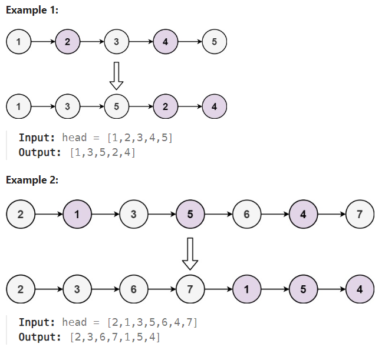

# LeetCode Problem: Delete the Middle Node of a Linked List

## Problem Explanation

Given the head of a singly linked list, you are tasked with deleting the middle node of the list. The middle node is defined as the node that lies exactly in the middle of the linked list. If there are two middle nodes (i.e., the list has an even number of nodes), you should delete the second middle node.

You must solve this problem in O(1) extra space complexity and O(n) time complexity.

### Example:



## Solution

Here's a Python solution for this problem:

```python
# Definition for singly-linked list.
# class ListNode:
#     def __init__(self, val=0, next=None):
#         self.val = val
#         self.next = next

class Solution:
    def deleteMiddleNode(self, head: Optional[ListNode]) -> Optional[ListNode]:
        if not head:
            return head

        slow = head
        fast = head
        prev = None

        while fast and fast.next:
            prev = slow
            slow = slow.next
            fast = fast.next.next

        if prev:
            prev.next = slow.next
        else:
            head = head.next

        return head
```

The solution works as follows:
1. We use two pointers, `slow` and `fast`, initially pointing to the head of the list.
2. `fast` moves twice as fast as `slow`, which allows us to find the middle node when `fast` reaches the end of the list.
3. We maintain a `prev` pointer to keep track of the node before the middle node.
4. Once `fast` reaches the end of the list, we update the `next` pointers to effectively remove the middle node from the list.
5. If the middle node is the head of the list, we update the head to the second node in the list.

This solution ensures that the middle node is deleted while preserving the relative order of the remaining nodes in the list.

Feel free to provide more test cases and run the code to validate its correctness.