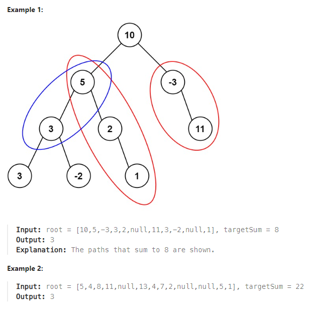

# LeetCode Problem: Path Sum III

## Problem Explanation

Given the root of a binary tree and an integer targetSum, the task is to return the number of paths in the binary tree where the sum of the values along the path equals the targetSum. The path does not need to start or end at the root or a leaf, but it must go downwards, i.e., traveling only from parent nodes to child nodes.

### Example:


## Solution

```python
# Definition for a binary tree node.
# class TreeNode:
#     def __init__(self, val=0, left=None, right=None):
#         self.val = val
#         self.left = left
#         self.right = right

class Solution:
    def pathSum(self, root: Optional[TreeNode], targetSum: int) -> int:
        def dfs(node, target, prefix_sum, prefix_sums):
            if node is None:
                return 0

            prefix_sum += node.val
            count = prefix_sums.get(prefix_sum - target, 0)

            prefix_sums[prefix_sum] = prefix_sums.get(prefix_sum, 0) + 1

            count += dfs(node.left, target, prefix_sum, prefix_sums) + dfs(node.right, target, prefix_sum, prefix_sums)

            prefix_sums[prefix_sum] -= 1

            return count

        prefix_sums = {0: 1}  # Initialize with a prefix sum of 0
        return dfs(root, targetSum, 0, prefix_sums)
```

The solution uses a depth-first search (DFS) algorithm to traverse the binary tree, keeping track of the prefix sums. Here's how it works:

1. The `dfs` function recursively explores the tree. It takes parameters `node` (the current node being considered), `target` (the target sum), `prefix_sum` (the cumulative sum along the current path), and `prefix_sums` (a dictionary that tracks the prefix sums and their counts).

2. If the current node is `None`, the function returns 0, as there is no path to consider.

3. The function updates the `prefix_sum` by adding the value of the current node.

4. It calculates the count of paths with the desired sum by checking if there is a prefix sum (`prefix_sum - target`) in the `prefix_sums` dictionary. If such a prefix sum exists, it means a path with the desired sum was found.

5. The `prefix_sums` dictionary is updated to include the current `prefix_sum`.

6. The function recursively calls itself for the left and right subtrees, adding their respective counts to the current count.

7. After traversing a subtree, the count for the current `prefix_sum` is updated in the `prefix_sums` dictionary, and the function returns the count.

8. The solution starts with an empty `prefix_sums` dictionary and calls the `dfs` function with the root node and the target sum.

### Detail Step:
```
node:  10
prefix_sums:  {0: 1, 10: 1}
prefix_sum:  10
want to find:  2
count:  0
-----------------------------------
node:  5
prefix_sums:  {0: 1, 10: 1, 15: 1}
prefix_sum:  15
want to find:  7
count:  0
-----------------------------------
node:  3
prefix_sums:  {0: 1, 10: 1, 15: 1, 18: 1}
prefix_sum:  18
want to find:  10
count:  1
-----------------------------------
node:  3
prefix_sums:  {0: 1, 10: 1, 15: 1, 18: 1, 21: 1}
prefix_sum:  21
want to find:  13
count:  0
-----------------------------------
remove prefix_sum:  21
-----------------------------------
node:  -2
prefix_sums:  {0: 1, 10: 1, 15: 1, 18: 1, 21: 0, 16: 1}
prefix_sum:  16
want to find:  8
count:  0
-----------------------------------
remove prefix_sum:  16
-----------------------------------
remove prefix_sum:  18
-----------------------------------
node:  2
prefix_sums:  {0: 1, 10: 1, 15: 1, 18: 0, 21: 0, 16: 0, 17: 1}
prefix_sum:  17
want to find:  9
count:  0
-----------------------------------
node:  1
prefix_sums:  {0: 1, 10: 1, 15: 1, 18: 1, 21: 0, 16: 0, 17: 1}
prefix_sum:  18
want to find:  10
count:  1
-----------------------------------
remove prefix_sum:  18
-----------------------------------
remove prefix_sum:  17
-----------------------------------
remove prefix_sum:  15
-----------------------------------
node:  -3
prefix_sums:  {0: 1, 10: 1, 15: 0, 18: 0, 21: 0, 16: 0, 17: 0, 7: 1}
prefix_sum:  7
want to find:  -1
count:  0
-----------------------------------
node:  11
prefix_sums:  {0: 1, 10: 1, 15: 0, 18: 1, 21: 0, 16: 0, 17: 0, 7: 1}
prefix_sum:  18
want to find:  10
count:  1
-----------------------------------
remove prefix_sum:  18
-----------------------------------
remove prefix_sum:  7
-----------------------------------
remove prefix_sum:  10
-----------------------------------
```

This solution efficiently counts the paths with the desired sum while exploring the entire tree, handling cases where the path can start or end at any node in the tree.
