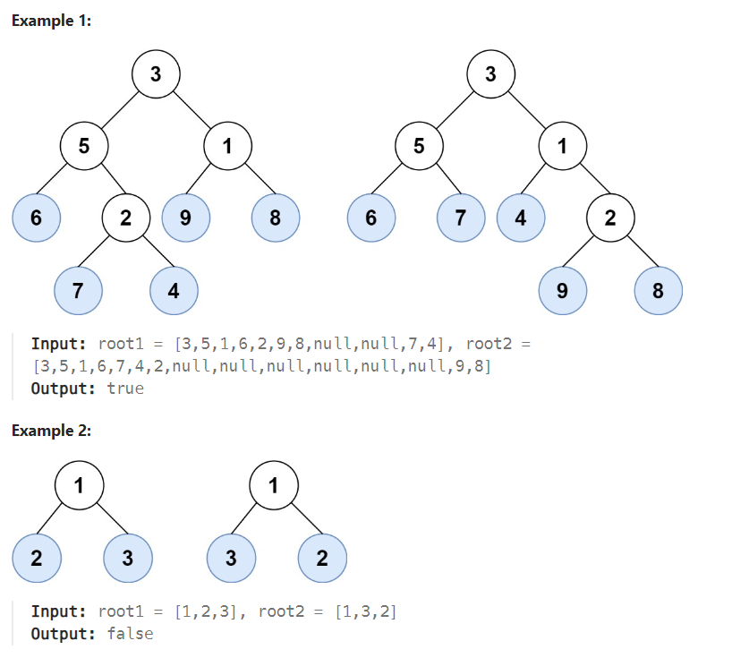

# LeetCode Problem: Leaf-Similar Trees

## Problem Explanation

Given two binary trees, determine if they are leaf-similar. In other words, if the values of the leaves in both trees are in the same order, the trees are considered leaf-similar.

### Example :



## Solution

```python
class Solution:
    def DFS(self, node, result):
        if node is None:
            return

        if node.left is None and node.right is None:
            result.append(node.val)
        else:
            self.DFS(node.left, result)  
            self.DFS(node.right, result)  

    def leafSimilar(self, root1: Optional[TreeNode], root2: Optional[TreeNode]) -> bool:
        leaf_values1, leaf_values2 = [], []
        self.DFS(root1, leaf_values1)
        self.DFS(root2, leaf_values2)

        return leaf_values1 == leaf_values2
```

### Explanation

The solution to this problem involves a depth-first search (DFS) traversal of both binary trees to collect the leaf values in the same order. If the leaf sequences are the same, the function returns `True`, indicating that the trees are leaf-similar.

1. We define a `DFS` function that takes a `node` and a `result` list. This function performs a depth-first search on the tree, recursively traversing the nodes. If the current node is a leaf node (i.e., it has no left or right children), we append its value to the `result` list.

2. The `leafSimilar` function is the entry point of the solution. It initializes two empty lists, `leaf_values1` and `leaf_values2`, to store the leaf values of the two trees.

3. We call the `DFS` function for both `root1` and `root2`, collecting the leaf values in `leaf_values1` and `leaf_values2`, respectively.

4. Finally, we compare `leaf_values1` and `leaf_values2`. If they are equal, the trees are leaf-similar, and the function returns `True`. Otherwise, it returns `False`.
